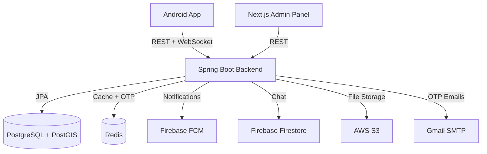
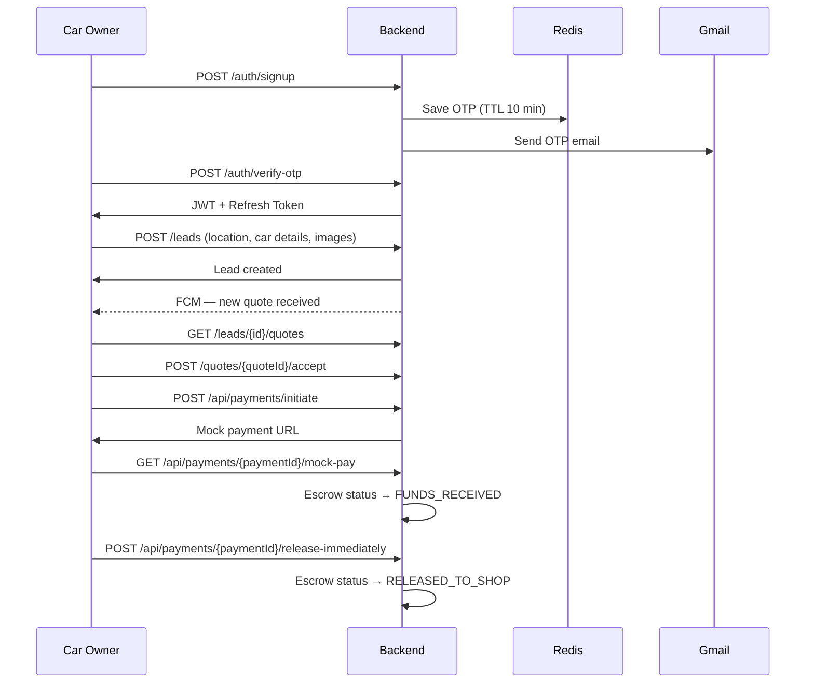
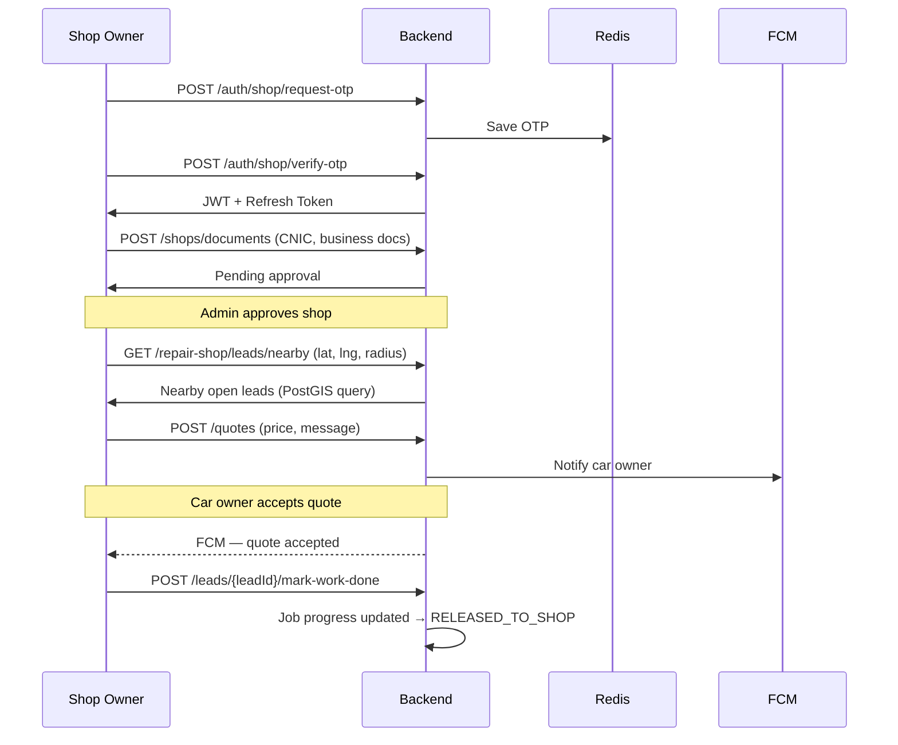
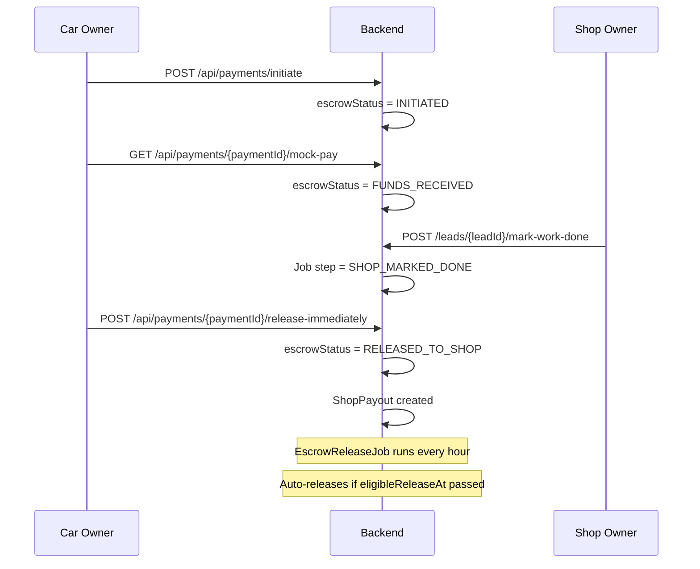
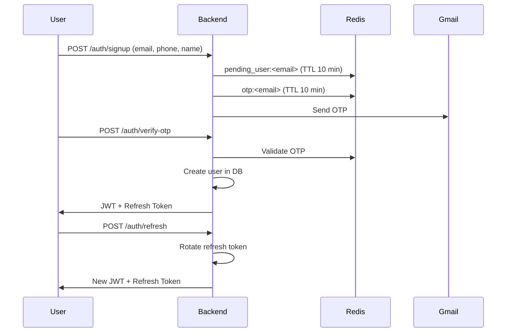

# Repairo — Backend

Repairo is a car repair marketplace where car owners post repair leads and nearby repair shops submit quotes. The platform handles real-time quote delivery, escrow-based payments, Firebase chat, and an admin panel for full oversight.

---

## Tech Stack

- Java 17, Spring Boot 3
- PostgreSQL + PostGIS (geospatial queries)
- Redis (OTP, rate limiting)
- Firebase Admin SDK (FCM notifications + Firestore chat)
- AWS S3 (document and image storage)
- WebSocket with STOMP/SockJS (real-time quotes)
- Flyway (database migrations)
- JWT with rotating refresh tokens
- Docker

---

## Roles

- CAR_OWNER — posts leads, accepts quotes, makes payments
- SHOP_OWNER — views nearby leads, submits quotes, receives payouts
- ADMIN — manages users, shops, leads, disputes via admin panel

---

## System Architecture



---

## Car Owner Flow



---

## Shop Owner Flow



---

## Escrow Payment Flow



---

## OTP Auth Flow



---

## Prerequisites

- Java 17
- Docker (for PostgreSQL + Redis)
- Firebase project with FCM and Firestore enabled
- AWS S3 bucket
- Gmail account with App Password enabled

---

## Environment Variables

Create an `application.properties` or use environment variables:

```
SPRING_DATASOURCE_URL=jdbc:postgresql://localhost:5432/carrepair
SPRING_DATASOURCE_USERNAME=your_db_user
SPRING_DATASOURCE_PASSWORD=your_db_pass

REDIS_HOST=localhost
REDIS_PORT=6379

JWT_SECRET=your_jwt_secret
JWT_EXPIRY_MS=900000
JWT_REFRESH_EXPIRY_MS=604800000

AWS_ACCESS_KEY=your_key
AWS_SECRET_KEY=your_secret
AWS_S3_BUCKET=carrepair-media
AWS_REGION=your_region

FIREBASE_CREDENTIALS_PATH=path/to/firebase-adminsdk.json

MAIL_USERNAME=your_gmail@gmail.com
MAIL_PASSWORD=your_app_password
```

---

## How to Run

Start PostgreSQL and Redis with Docker:

```bash
docker run --name carrepair-db -e POSTGRES_PASSWORD=yourpass -e POSTGRES_DB=carrepair -p 5432:5432 -d postgres
docker run --name carrepair-redis -p 6379:6379 -d redis
```

Run the backend:

```bash
./mvnw spring-boot:run
```

Backend runs on `http://localhost:8080`

---

## API Overview

**Auth** — signup, OTP verify, login, refresh, logout (car owner + shop owner + admin)

**Leads** — post lead, nearby leads, my leads, cancel lead, lead detail

**Quotes** — submit quote, get quotes for lead, accept/reject quote, real-time via WebSocket

**Payments** — initiate payment, mock pay, escrow release, payment status

**Chat** — Firestore-based real-time chat, channel creation via backend

**Admin** — user management, shop approval, lead oversight, analytics, activity logs, dashboard stats

Full endpoint list is available in the project documentation.

---

## Key Decisions

- Payments are mocked (Stripe unavailable in Pakistan) with a custom escrow simulation
- OTP via Gmail SMTP, not AWS SES
- Geospatial lead matching via PostGIS
- Chat via Firebase Firestore, not a third-party SDK
- Admin tokens stored in httpOnly cookies, all admin API calls proxied through Next.js
- JWT with rotating refresh tokens
- User block revokes all refresh tokens and triggers FCM notification instantly
